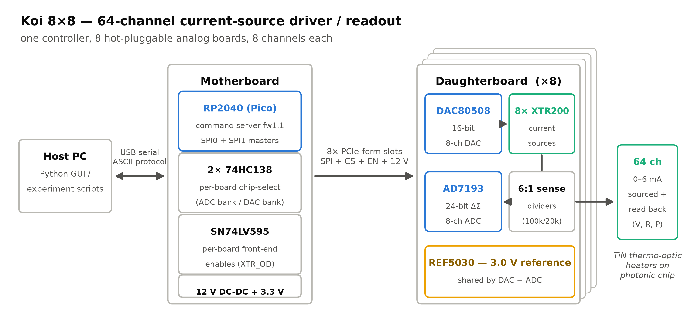
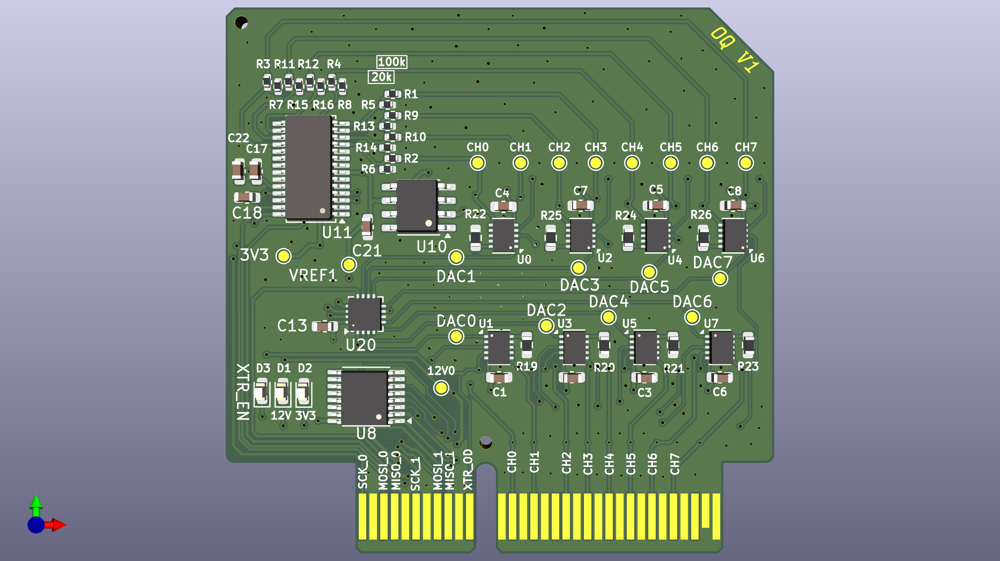
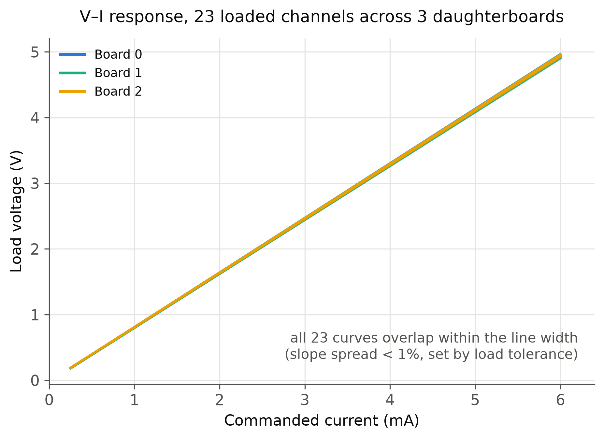
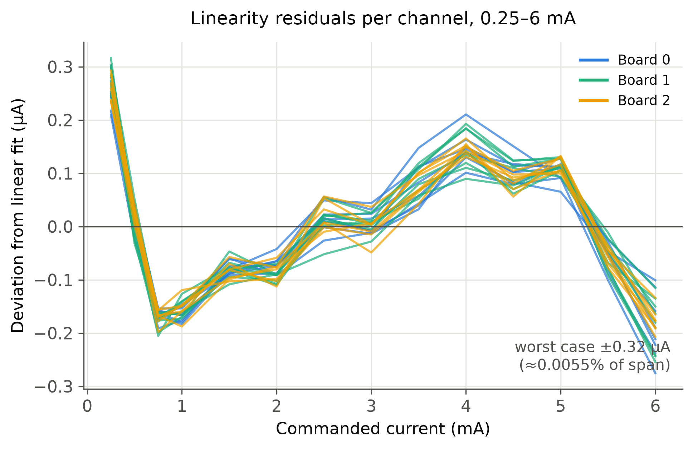
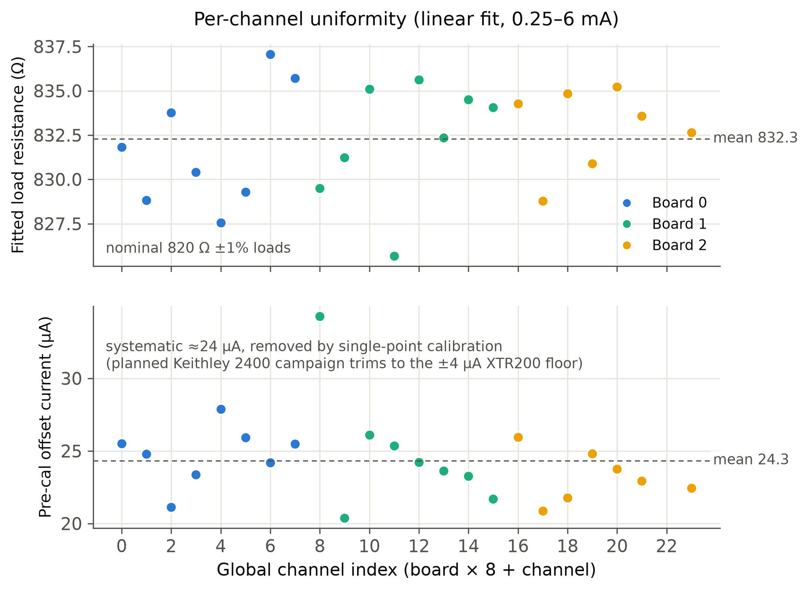

# Koi 8×8 — 64-channel current-source driver / readout

An open-hardware, low-cost controller for driving **TiN thermo-optic heaters on
photonic chips**: 64 independent precision current sources with per-channel
voltage readback, built from one controller board and eight hot-pluggable
8-channel analog boards.

Each daughterboard pairs a 16-bit DAC (DAC80508) with eight XTR200 precision
current sources, and reads the voltage across each load through a 6:1 divider
with a 24-bit ΔΣ ADC (AD7193), so the host gets current, voltage, resistance,
and power per channel. A Raspberry Pi Pico (RP2040) on the motherboard runs a
line-based ASCII command server over USB — one `ISETA` sets all 64 currents,
one `MEASA?` reads all 64 voltages.

## The boards

| [Motherboard](hardware/motherboard/) — RP2040 controller, 8 slots | [Daughterboard](hardware/daughterboard/) — 8 analog channels, ×8 |
| --- | --- |
|  |  |

Renders are regenerated from the KiCad boards with `kicad-cli pcb render`; each
board's own README has top, bottom, and transparent-background views.

## Key numbers

| Metric | Value |
| --- | --- |
| Channels | 64 (8 boards × 8), hot-pluggable per board |
| Current range | 0–6 mA per channel (working range 0.25–6 mA), 16-bit setting |
| Readback | 24-bit ΔΣ, divider-corrected load voltage → V / R / P per channel |
| Linearity (measured, 23 ch) | worst-case ±0.32 µA deviation from linear over 0.25–6 mA (≈0.006 % of span) |
| Offset (pre-calibration) | ≈24 µA systematic, uniform across channels; single-point cal brings it to the ±4 µA XTR200 device floor (Keithley campaign planned) |
| Full 64-channel scan | ≈11 ms/channel at the default filter rate (~0.7 s for all 64; filter rate adjustable live) |
| Parts cost | **$709 per system ≈ $11.08/channel** ([master_bom.csv](master_bom.csv)) — commercial equivalents (e.g. Qontrol) ≈ $125/channel |

## Measured results (3 boards / 24 channels, 2026-07-03)

| | |
| --- | --- |
|  |  |

Three populated daughterboards were swept 0.1–6 mA into nominal 820 Ω ±1 %
loads (one channel had no load fitted during the run and is excluded). All 23
loaded channels are linear to within ±0.32 µA and show a uniform ~24 µA
pre-calibration offset — a systematic that the planned per-channel calibration
removes. Figures are regenerated from the raw bench CSVs by
`report/figures/make_figures.py`.

## What's in this folder

| Path | Contents |
| --- | --- |
| `report/figures/` | Architecture diagram + measurement figures (and the scripts that generate them) |
| `hardware/motherboard/` | KiCad project, schematic PDF (`Schematics/`), power-tree spec (`POWER.md`), top/bottom/transparent renders, fab outputs (`production/`: gerbers, BOM, positions) |
| `hardware/daughterboard/` | Same set for the analog board, plus an interactive HTML BOM (`bom/ibom.html`) |
| `hardware/render/` | Headless KiCad → pcb2blender → Cycles pipeline for photorealistic board renders |
| `master_bom.csv` | Consolidated system BOM with unit prices and cost total |
| `firmware/motherboard-test/` | RP2040 firmware (PlatformIO, `pio run -t upload`) and Python host tools — `tools/koi_gui.py` is a live 8×8 monitor GUI; `tools/*.csv` are the raw bench datasets |
| `paper/main.pdf` | Draft HardwareX manuscript (validation section pending the calibration campaign) |

## Status (August 2026)

**In fab:** both revised boards were released to fabrication on **2026-08-12**.
The motherboard adds the protected input stage (PPTC + SMBJ16A TVS + P-FET
reverse-polarity with a BZT52C18 gate clamp), the 12 → 5 → 3.3 V tree with the
`3V3_EN` interlock, a +12 V sense divider into `GPIO26`, and the `U3.~OE`
cutover to `GPIO19`; the daughterboard adds the OPA2333 followers (U13–U16) and
their 1 kΩ series resistors. `hardware/*/production/` holds the exact gerber /
BOM / position sets that were sent.

**Done:** rev-1 hardware designed, fabricated, and brought up; firmware 1.1
with robust host protocol (auto-detection, hot-rescan, fast scanning); host GUI
and calibration tooling; all 8 daughterboards populated and tested (initial
3-board/24-channel results above — production sign-off).

**Resolved:** the ~3 mV offset seen during the 8-board test was the AD7193's
*internal* input buffer. With the 6:1 divider, a low-current channel's ADC input
sits below the buffered mode's usable common-mode range, so the buffer added a
systematic offset rather than tracking. Fixed by disabling it (`CONF.BUF = 0`)
and adding 8 external unity-gain **OPA2333** followers (U13–U16) between the
divider taps and the ADC inputs.

**Next:** Keithley 2400/2100 per-channel calibration campaign (jig designed,
parts list ready); HardwareX submission.
