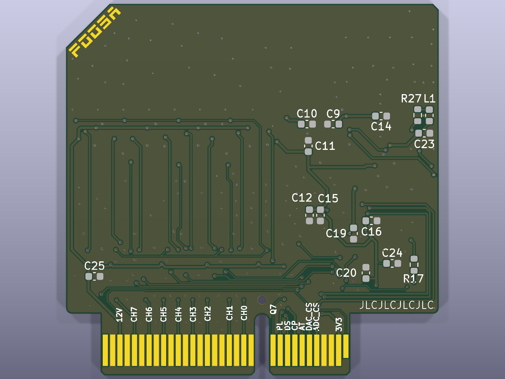
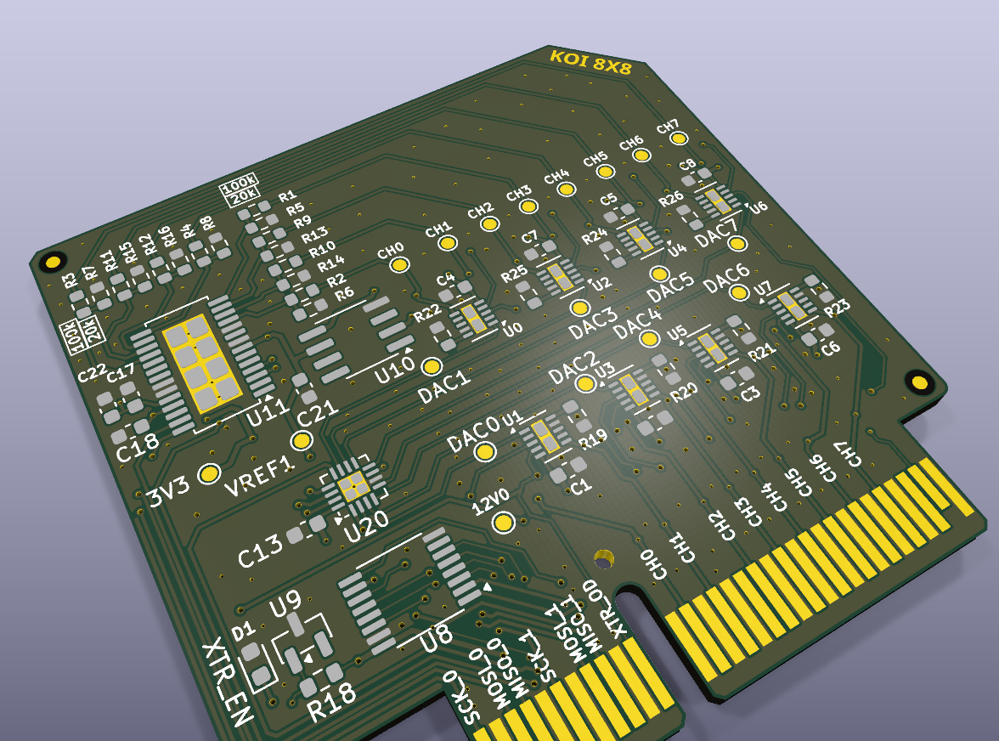
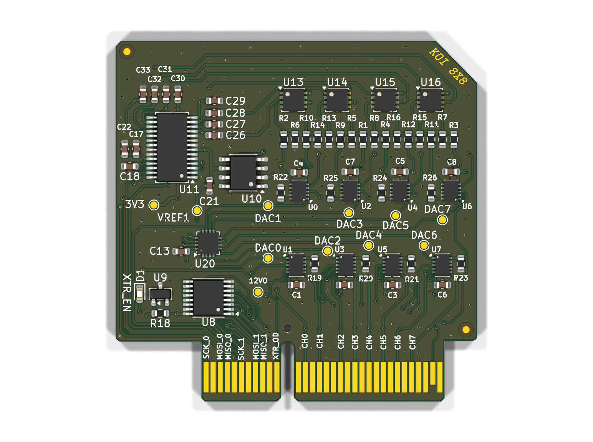

# Daughterboard — 8-channel analog board

The analog front-end board for Koi 8×8. Eight of these plug into one
[motherboard](../motherboard/) over a PCIe-x4 card-edge connector, giving the
system 8 boards × 8 channels = 64 independent current sources with voltage
readback. Formerly codenamed `OuttaQontrol`/`OuttaControl`.

| Top | Bottom |
| --- | --- |
|  |  |

Same top view with an alpha background, for dropping onto slides or into the
paper's figures:

## What's on it

| Ref | Part | Function |
| --- | --- | --- |
| U0–U7 | XTR200 (WSON-10) | Precision current-source front end, one per channel |
| U20 | DAC80508Z (WQFN-16) | 16-bit, 8-channel DAC — sets the 8 channel currents |
| U11 | AD7193 (TSSOP-28) | 24-bit ΔΣ ADC — reads back the 8 channel voltages |
| U10 | REF5030 (SOIC-8) | 3.0 V precision reference, shared by the DAC and ADC on this board |
| U8 | SN74LV165A (TSSOP-16) | Parallel-load 8-bit shift register |
| U9 | AT21CS01 | 1-Wire EEPROM (board ID/config) — new in this revision |
| R19–R26 | 4.7 kΩ 0.1 % | Per-channel sense resistors |
| R1–R4, R9–R12, R17 / R5–R8, R13–R16 | 100 kΩ / 20 kΩ 0.1 % | 6:1 sense divider (top/bottom) — firmware reads the raw ADC-pin voltage and the host applies ×6 to get true heater voltage |
| J1 | Custom PCIe-x4 card-edge | Connector into the motherboard slot |

Full pricing and part numbers: [`../../master_bom.csv`](../../master_bom.csv).

## Files

| File | What it is |
| --- | --- |
| `daughterboard.kicad_pro` / `.kicad_sch` / `.kicad_pcb` | The KiCad project (current revision) |
| `Schematics/daughterboard.pdf` | Exported schematic |
| `bom/ibom.html` | Interactive HTML BOM (open in a browser) |
| `production/` | Fab outputs — gerbers, BOM, positions, netlist |
| `daughterboard*.png` | Board views above, regenerated with `kicad-cli pcb render` |
| `version 1/` | The prior board revision (pre-EEPROM), kept for reference, incl. its own PDN sim results |
| `padne_out_v3/`, `results_v3/` | Power-delivery-network (PDN) simulation outputs for this revision — current-density and IR-drop maps |

Photorealistic Cycles renders (`daughterboard_render*.png`) are produced by the
pipeline in [`../render/`](../render/) — not generated yet.

See **[`CLAUDE.md`](CLAUDE.md)** for the full development-facing breakdown of
these files, the netlist/revision history, and the padne PDN simulation
workflow in detail.
