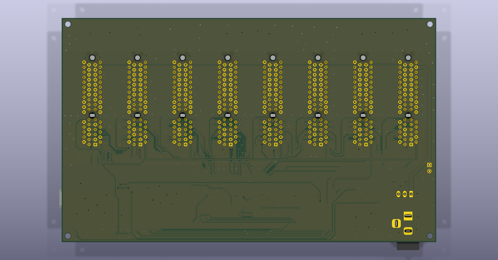
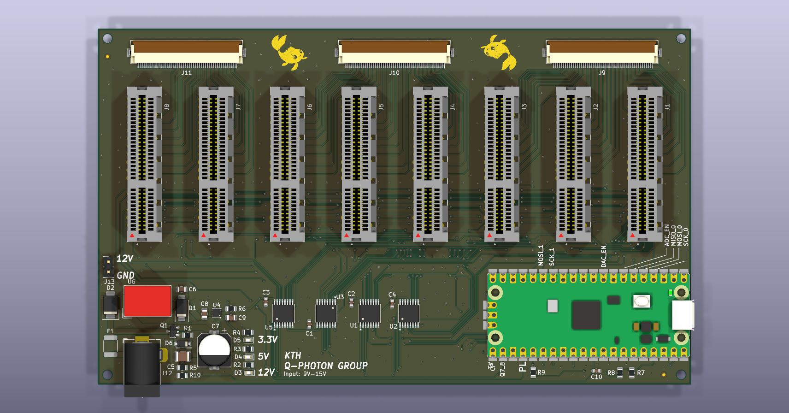
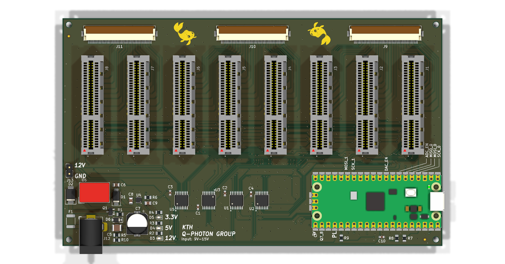

# Motherboard — RP2040 controller board

The controller board for Koi 8×8. Carries a Raspberry Pi Pico (RP2040) and
hosts up to 8 [daughterboards](../daughterboard/) in PCIe-x4 card-edge slots,
addressing each board's DAC/ADC over a shared SPI bus. Formerly codenamed
`MOBO`. The PC talks to the Pico's firmware over USB serial — see
[`firmware/motherboard-test/`](../../firmware/motherboard-test/).

| Top | Bottom |
| --- | --- |
|  |  |

Same top view with an alpha background, for dropping onto slides or into the
paper's figures:

## What's on it

| Ref | Part | Function |
| --- | --- | --- |
| A1 | Raspberry Pi Pico (RP2040) | Runs the firmware; USB-serial host link |
| U1, U5 | SN74LV138 (74HC138) | 3-to-8 decoders — ADC/DAC chip-select across the 8 slots |
| U3 | SN74LV595 | Shift register — XTR200 front-end enables |
| U2 | TMUX1208PW | 8:1 analog mux |
| J1–J8 | Samtec PCIE-064-02-F-D-TH | 8 daughterboard slots (PCIe-x4 sockets) |
| J9–J11 | Molex 54132-5033 | 50-pin FFC connectors — channel outputs |

### Power tree

The barrel jack is the only power source; the Pico is a peripheral that cannot
run without it, enforced in hardware by the `3V3_EN` interlock (R7/R8) rather
than in firmware. Full design rationale: [`POWER.md`](POWER.md).

| Ref | Part | Function |
| --- | --- | --- |
| J12 | Barrel jack + switch pin | DC power in, 9–15 V |
| F1 | 1812L150/24MR polyfuse | Input overcurrent protection |
| D2 | SMBJ16A | Input TVS clamp (26 V clamping voltage) |
| Q1 | AO3407A | P-FET reverse-polarity protection |
| D6 | BZT52C18 | `Q1` gate–source clamp |
| U6 | K7805-500R3 | 5 V switching regulator |
| U4 | LP5912-3.3DRV | 3.3 V LDO — logic rail and daughterboard `+3V3` |
| D1 | SS34 | Feeds the Pico's VSYS from the board's 5 V rail |
| R7, R8 | 10 kΩ / 4.7 kΩ | `3V3_EN` interlock divider |
| R5, R10, C10 | 100 kΩ / 22 kΩ / 100 nF | +12 V sense divider into `GPIO26`/ADC0 (×5.5455) |

Full pricing and part numbers: [`../../master_bom.csv`](../../master_bom.csv).

## Files

| File | What it is |
| --- | --- |
| `motherboard.kicad_pro` / `.kicad_sch` / `.kicad_pcb` | The KiCad project |
| `Schematics/motherboard.pdf` | Exported schematic |
| `production/` | Fab outputs — gerbers, BOM, positions, netlist |
| `POWER.md` | Power-tree design spec — input protection chain and the `3V3_EN` interlock |
| `motherboard*.png` | Board views above, regenerated with `kicad-cli pcb render` |
| `PCIE-064-02-F-D-TH.stp`, `Pico.wrl` | 3D models used for the renders above |

Photorealistic Cycles renders (`motherboard_render*.png`) are produced by the
pipeline in [`../render/`](../render/) — not generated yet.
